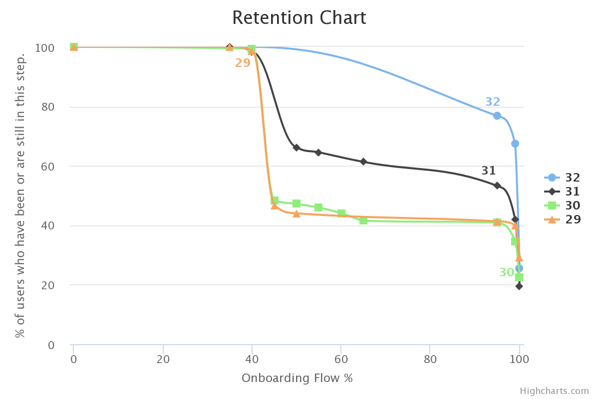

# Temper
##### API & Web services for the retention chart.
`git clone git@github.com:raphaeloliveiro/Temper.git`

## Index

- [Back-end API](#back-end-api)
  - Requirements
  - Installation
  - Test
- [Front-end](#front-end)
  - Requirements
  - Installation

---

## Back-end API
### Requirements
- PHP >= 7.1.3
- MySQL

### Installation
- `cd Temper-API-Laravel`
- `composer install`
- `cp .env.example .env` _(configure accordingly.)_
- `php artisan key:generate`
- `php artisan migrate`
- `php artisan db:seed`
- `php artisan serve`

##### Or simply `sh run.sh` _(prerequisites: .env configured accordingly.)_

### Test
- `phpunit`

---

## Front-end
### Requirements
- Node.JS, NPM installed globally in your OS

### Installation
- `cd Temper-Web-HighCharts`
- `node .`
- Running on http://localhost:8080 _(make sure the API is running parallelly)_
